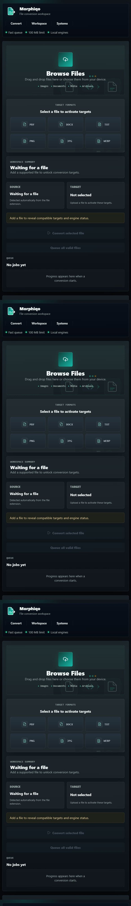
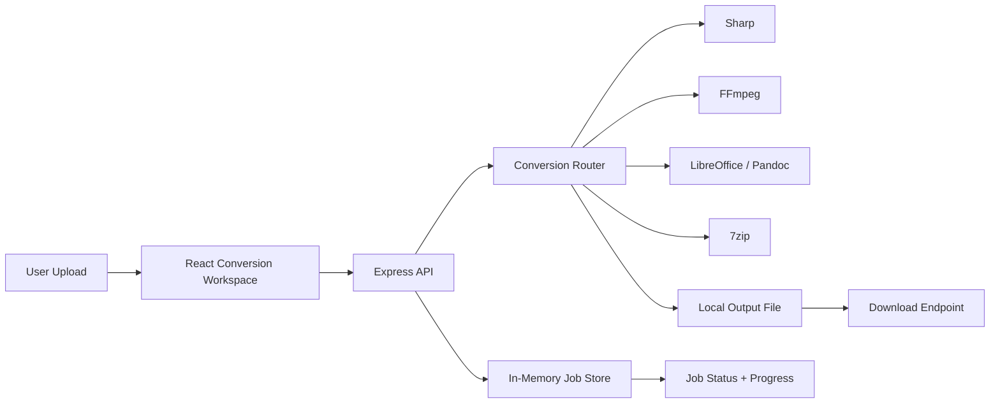
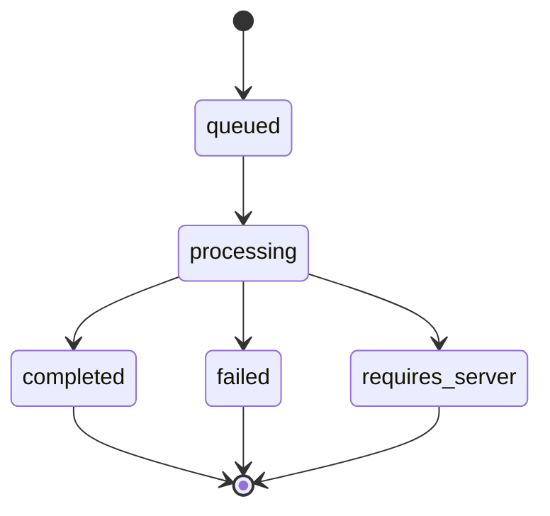

# Morphiqo

Morphiqo is a professional file conversion workspace designed for a local-first, engine-backed workflow. It combines a polished SaaS-style interface with an Express conversion backend that tracks uploads, jobs, output files, and engine availability through a clear operational pipeline.

Built and vibe-coded by **noutrexx**, Morphiqo presents file conversion like a command center: source detection, compatible target selection, job progress, conversion history, and download handling are all organized into a structured product experience.



## Product Overview

Morphiqo is built for users who need a clean and reliable way to convert files without handing them to third-party cloud services. The product is intentionally local-first: uploads are stored locally, conversions are executed through local engines, and output files are served from the backend only after a tracked job completes.

Core product goals:

- Make file conversion feel clear, premium, and trustworthy
- Detect the uploaded source format automatically
- Show only relevant target formats for the active file
- Track every conversion as a job with explicit status and progress
- Fail gracefully when a required local engine is not installed
- Keep the frontend focused on user flow and the backend focused on conversion orchestration

## Key Capabilities

- Drag-and-drop upload area with automatic source format detection
- Dynamic target format grid based on the selected file type
- Job queue with `queued`, `processing`, `completed`, `failed`, and `requires_server` states
- Conversion history with quick download access
- Real Sharp-backed image conversion for `jpg`, `png`, and `webp`
- Extractable PDF conversion paths for text-based PDFs
- External engine routing for media, office documents, presentations, spreadsheets, and archives
- Secure upload handling with file size limits, extension validation, sanitized filenames, and isolated output paths
- Dark, professional interface with shadcn-style local UI primitives

## System Architecture



The current job store is in-memory for development speed, but the conversion flow is separated so it can be moved to Redis, a database, or a worker queue later.

## Screenshots

Project screenshots are stored in `docs/screenshots`.

- `docs/screenshots/00-full-page.png`
- `docs/screenshots/01-convert-workspace.png`
- `docs/screenshots/02-systems.png`
- `docs/screenshots/03-workspace-detail.png`

## Tech Stack

| Layer | Technology |
| --- | --- |
| Frontend | React 19, TypeScript, Vite |
| Styling | Tailwind CSS 4, custom CSS system, shadcn-style primitives |
| UI Icons | Lucide React |
| Backend | Express 5, TypeScript |
| Uploads | Multer |
| Image Engine | Sharp |
| PDF Text Paths | `pdf-parse`, `docx` |
| External Engines | FFmpeg, LibreOffice, Pandoc, ImageMagick, 7zip |

## Requirements

Required:

- Node.js 20 or newer
- npm 10 or newer

Optional local engines:

- FFmpeg for video and audio conversion
- LibreOffice headless for office documents, spreadsheets, and presentations
- Pandoc for document-oriented conversion paths
- ImageMagick for extended image conversion coverage
- 7zip for archive conversion

If an optional engine is missing, Morphiqo does not crash. The related job returns a readable status and message so the user understands what is required.

## Environment Configuration

Create `.env` from `.env.example`:

```bash
VITE_API_BASE_URL=http://localhost:3000
PORT=3000
FRONTEND_ORIGIN=http://localhost:5173,http://127.0.0.1:5173
UPLOAD_DIR=uploads
OUTPUT_DIR=outputs
```

## Local Development

Install dependencies:

```bash
npm install
```

Start the frontend:

```bash
npm run dev
```

Start the backend in a second terminal:

```bash
npm run dev:api
```

Default URLs:

- Frontend: `http://localhost:5173`
- Backend API: `http://localhost:3000`

## API Reference

### `POST /api/convert`

Creates a conversion job from an uploaded file.

Request:

- `file`: uploaded file
- `targetFormat`: desired output format

Response includes:

- `jobId`
- `status`
- `progress`
- `message`
- `sourceFormat`
- `targetFormat`
- `downloadUrl` when complete

### `GET /api/jobs/:jobId`

Returns the latest status, progress, output metadata, and user-facing message for a conversion job.

### `GET /api/jobs/:jobId/download`

Downloads the completed output file.

### `GET /api/formats`

Returns format groups and engine mapping used by the backend.

## Job Lifecycle



## Current Conversion Coverage

Sharp-backed image conversions:

- `jpg -> png`
- `jpg -> webp`
- `png -> jpg`
- `png -> webp`
- `webp -> jpg`
- `webp -> png`

Extractable PDF paths:

- `pdf -> txt`
- `pdf -> html`
- `pdf -> md`
- `pdf -> docx`

Additional conversion pairs are routed to optional system engines when they are installed.

## Security And Operational Notes

- Uploads are limited to 100 MB by default
- Uploaded filenames are sanitized before storage
- Source and target formats are validated before conversion starts
- Output files are written to a configured `outputs` directory
- Upload and output directories are ignored by Git
- External commands are executed through `spawn`, avoiding direct shell interpolation of user filenames
- Missing engines are converted into explicit job states instead of process-level crashes

## Validation

Run the full local verification suite:

```bash
npm run lint
npm run build
npm run build:api
```

## Important Source Files

- `src/App.tsx`: main product shell, navigation, and section layout
- `src/App.css`: visual system and responsive layout
- `src/components/ConversionPanel.tsx`: upload, target selection, and primary conversion controls
- `src/components/SupportedFormatsPanel.tsx`: compatible conversion target display
- `src/components/ConversionHistory.tsx`: active uploads, local history, and quick download states
- `src/hooks/useConversionManager.ts`: frontend queue, active file, polling, retry, and history logic
- `src/config/conversionRules.ts`: frontend conversion rules
- `src/config/formats.ts`: backend format groups and engine mapping
- `src/services/conversionService.ts`: backend conversion router
- `src/services/imageService.ts`: Sharp and ImageMagick image conversion service
- `src/services/documentService.ts`: document, spreadsheet, and presentation conversion service
- `src/services/pdfService.ts`: extractable PDF conversion service
- `src/services/videoService.ts`: FFmpeg media conversion service
- `src/services/archiveService.ts`: 7zip archive conversion service
- `src/jobs/jobStore.ts`: job tracking layer
- `src/routes/convert.ts`: upload and job creation endpoint
- `src/routes/jobs.ts`: job status and download endpoints

## Roadmap

- Move jobs from memory to Redis or a database-backed store
- Add a worker process for long-running conversions
- Add engine health checks to the UI
- Add authenticated multi-user job history
- Add OCR support for scanned PDFs
- Add automated integration tests for the upload-to-download flow

## Ownership

Morphiqo is a local-first conversion product by **noutrexx**. The project intentionally balances a polished product surface with a practical backend engine architecture that can keep growing without turning into a fragile demo.
