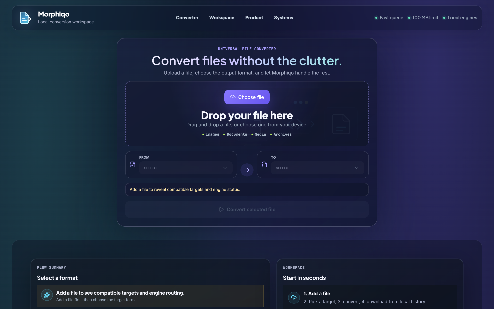
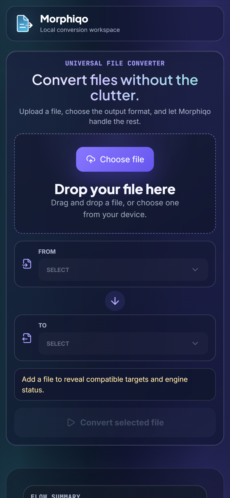
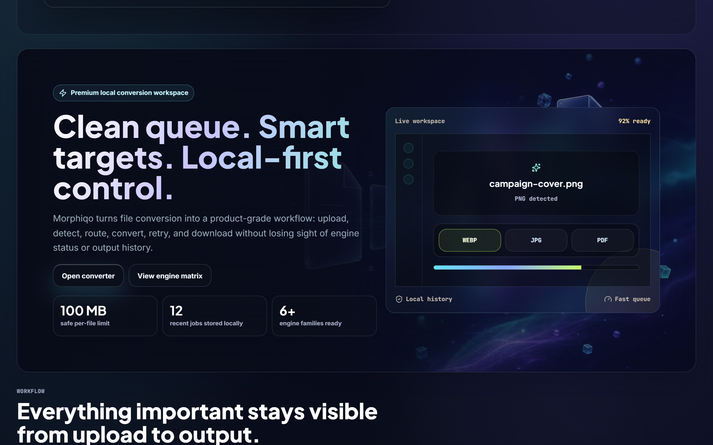
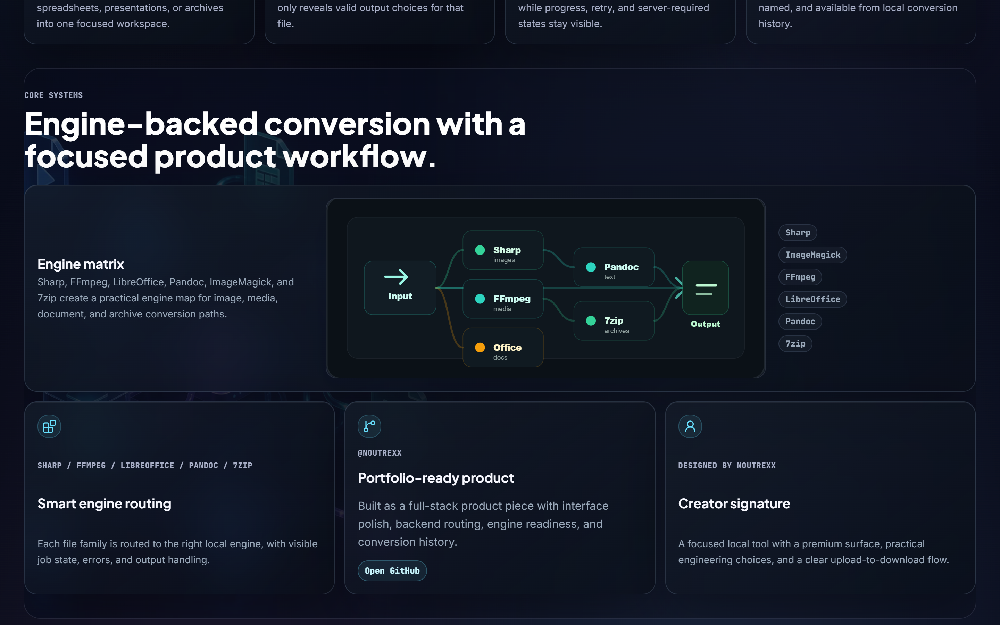

# Morphiqo

A local-first file conversion workspace with a polished React interface, job-based Express backend, real Sharp image conversions, and engine-ready services for documents, media, and archives.

Designed and vibe-coded by **noutrexx**.


## Preview

<p align="center">
  
</p>

The centered glass converter is the first thing you see: drag and drop, source and target format selectors, engine status, and the primary conversion action all fit in the first viewport. A soft focal glow anchors the panel and a living aurora drifts behind the whole surface.

<br />

### Additional views

<p align="center">
  
</p>

<p align="center">
  Responsive mobile view of the centered converter flow.
</p>

<br />

<p align="center">
  
</p>

<p align="center">
  Product story section with metrics and a live workspace preview.
</p>

<br />

<p align="center">
  
</p>

<p align="center">
  Engine systems section with the conversion routing matrix.
</p>

## Highlights

- Centered first-viewport converter with a responsive glassmorphism interface
- Automatic source format detection from the uploaded file
- Target formats filtered to only show valid options for the active file
- Job tracking with progress, status messages, retry, history, and downloads
- Real local image conversion with Sharp for `jpg`, `png`, and `webp`
- Extractable PDF conversion paths for `txt`, `html`, `md`, and `docx`
- Backend routing prepared for FFmpeg, LibreOffice, Pandoc, ImageMagick, and 7zip
- Safer file handling with size limits, sanitized names, and isolated output files

## Design Language

- Local-first glassmorphism: layered translucent panels over a living aurora background
- Typeface system loaded for the intended look — Plus Jakarta Sans (display), Inter (body), JetBrains Mono (labels)
- Gradient display ink on the primary headings for brand character
- A focal glow anchors the centered converter so the primary action reads first
- Motion is subtle and respects `prefers-reduced-motion`

## Tech Stack

- Frontend: React, TypeScript, Vite
- Styling: Tailwind CSS, custom CSS, shadcn-style local UI components
- Backend: Express, TypeScript, Multer
- Conversion: Sharp, pdf-parse, docx, external engine runner
- Optional engines: FFmpeg, LibreOffice, Pandoc, ImageMagick, 7zip

## Requirements

Required:

- Node.js 20 or newer
- npm 10 or newer

Optional conversion engines:

- FFmpeg: video and audio conversions
- LibreOffice: document, spreadsheet, and presentation conversions
- Pandoc: document format conversions
- ImageMagick: extended image conversions
- 7zip: archive conversions

Windows install examples:

```powershell
winget install OpenJS.NodeJS.LTS
winget install Gyan.FFmpeg
winget install TheDocumentFoundation.LibreOffice
winget install 7zip.7zip
winget install ImageMagick.ImageMagick
```

macOS install examples:

```bash
brew install node ffmpeg libreoffice pandoc imagemagick p7zip
```

Linux install examples:

```bash
sudo apt install nodejs npm ffmpeg libreoffice pandoc imagemagick p7zip-full
```

Sharp image conversions work after `npm install`. The optional engines are only needed for the conversion families that depend on them.

## Getting Started

```bash
git clone https://github.com/noutrexx/morphiqo.git
cd morphiqo
npm install
cp .env.example .env
```

Run the frontend:

```bash
npm run dev
```

Run the backend in another terminal (required for real engine-backed conversions):

```bash
npm run dev:api
```

Open `http://localhost:5173`.

## Conversion Behavior

Morphiqo runs in one of two modes depending on whether the backend is reachable:

- **Engine mode (backend running).** With `npm run dev:api` up and `VITE_API_BASE_URL` set, files are uploaded to the Express API and converted by real engines — Sharp for `jpg`/`png`/`webp`, plus the optional engines (FFmpeg, LibreOffice, Pandoc, ImageMagick, 7zip) for everything else.
- **Browser mock mode (no backend, development only).** If the API is unreachable while running `npm run dev`, the UI falls back to an in-browser mock so the workflow stays explorable: a `<canvas>` re-encode for `jpg`/`png`/`webp` and simple text transforms for `txt`/`html`/`md`. This is for previewing the interface, not for production-grade output. In a production build there is no mock fallback — an unreachable API surfaces an error instead.

Backend jobs are kept in an in-memory store (capped at the most recent 200) and reset when the API process restarts. Persistent job storage and worker queues are intentionally left as next steps.

## Environment

```env
VITE_API_BASE_URL=http://localhost:3000
PORT=3000
FRONTEND_ORIGIN=http://localhost:5173,http://127.0.0.1:5173
UPLOAD_DIR=uploads
OUTPUT_DIR=outputs
```

## API

- `POST /api/convert` creates a conversion job from an uploaded file.
- `GET /api/jobs/:jobId` returns job status, progress, output metadata, and messages.
- `GET /api/jobs/:jobId/download` downloads the completed output file.
- `GET /api/formats` returns supported format groups and engine mapping.

## Job States

- `queued`
- `processing`
- `completed`
- `failed`
- `requires_server`

## Current Conversion Coverage

Sharp-backed image conversions:

- `jpg -> png`
- `jpg -> webp`
- `png -> jpg`
- `png -> webp`
- `webp -> jpg`
- `webp -> png`

PDF text extraction paths:

- `pdf -> txt`
- `pdf -> html`
- `pdf -> md`
- `pdf -> docx`

Other conversion pairs are routed to optional local engines when they are installed.

## Validation

```bash
npm run lint
npm run build
npm run build:api
```

## Project Scope

Morphiqo was built as a full-stack product engineering project. The focus is the boundary between a clean converter UI and a backend conversion pipeline that can grow into worker queues, persistent job storage, and wider engine support.
